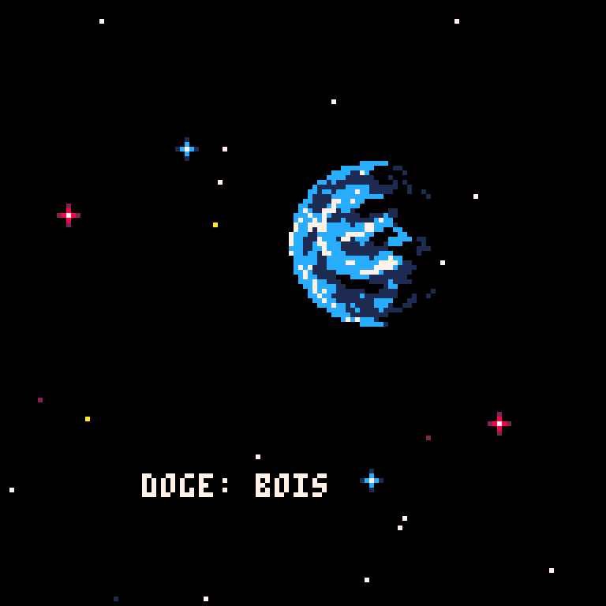
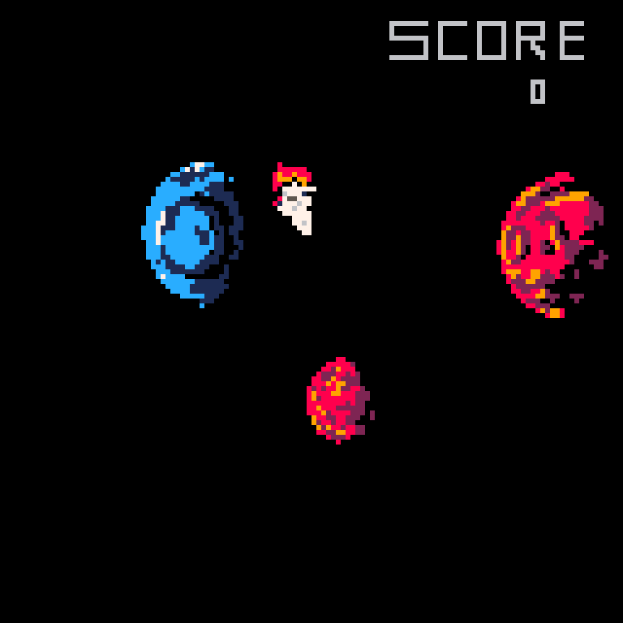
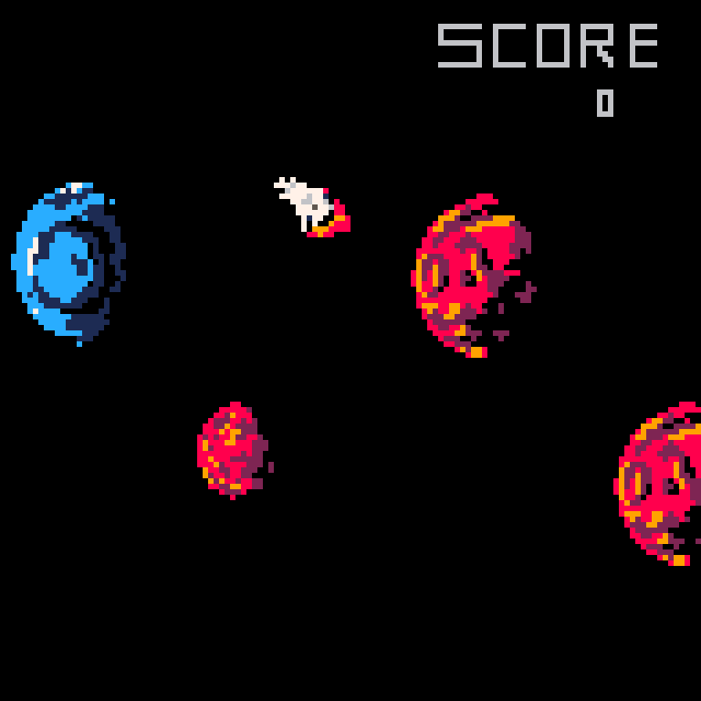
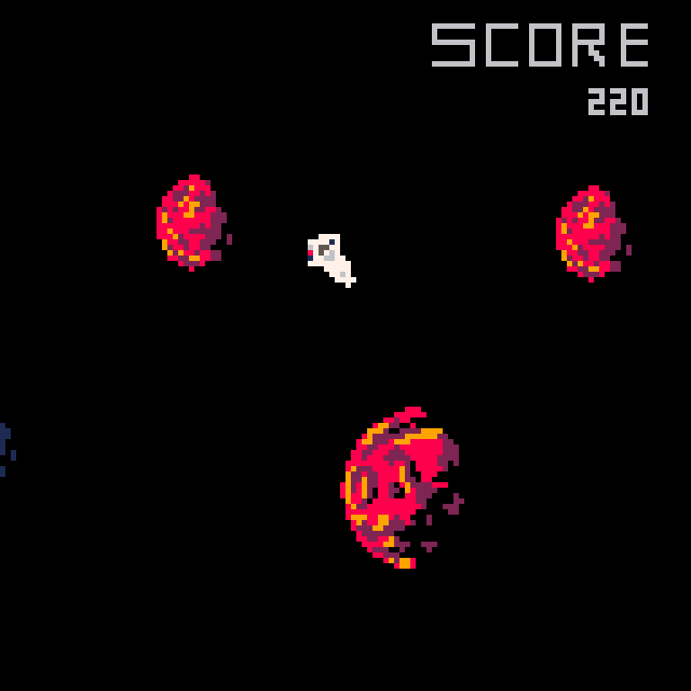
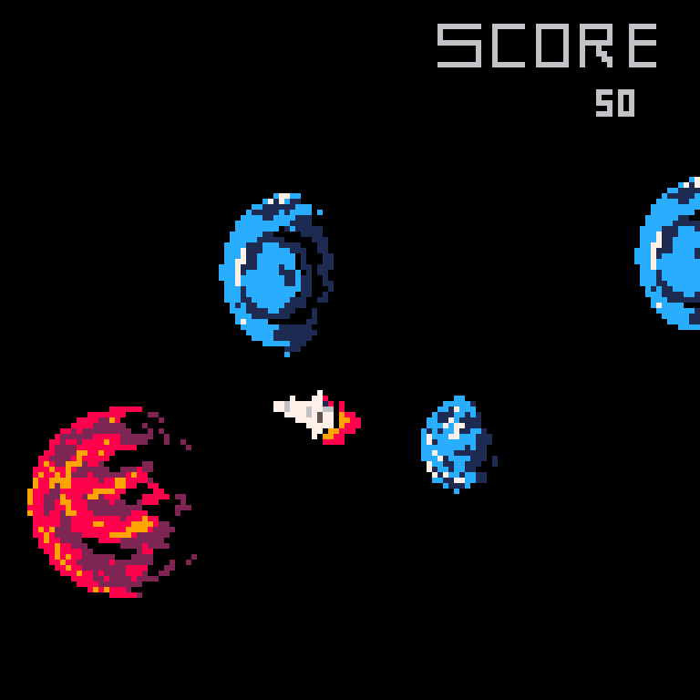

# DOGE: BOIS

**DOGE: BOIS** - Dangerous Orbit Genesis: Endgame; Beyond our Intergalactic Space

Small game created in under 48 hours for [Discord Jam 2](https://itch.io/jam/discord-jam-2) with the theme of **Space**.

Game is built using [Lua](https://www.lua.org/), with the [PICO-8](https://www.lexaloffle.com/pico-8.php) Fantasy Console.

**[Discord Jam 2 Page](https://itch.io/jam/discord-jam-2/rate/473619)**

**[Play Original Version](https://woofers.itch.io/dogebois)** entered in [Discord Jam 2](https://itch.io/jam/discord-jam-2)

## Story

Commander DB (Dog Bonez) is in a pickle. He left his Nano-Bulbous-Gravitron-Phaser v3, a cosmic dog toy, at home.
His issue is that his home, the kennel planet, is on the other side of the galaxy 5 000 000 dog years away.

Using nearby planets' gravitational pull, DB aims to use the power of ORBITing gravity to make it home a couple of dog years shorter.

## Instructions

Hop to the orbit of the next planet using the **SPACE** key.
The tip of the ship should be pointed at the planet you intend to move to.
If you miscalculate the trajectory of the planet, you will orbit in-space forever and need to restart.
You can not move to planets in the opposite direction of travel as the gravitational force is moving strongly to the right
and attempting to move against it will result in the shuttle doing a flip.

## Controls

-   **Space** - Jump planets / menu

## Screenshots

## Credits

-   **[Avery Suzuki](https://www.instagram.com/suzukiavery/)** - Art
-   **[Parker Swinton](https://github.com/ParkerSwinton)** - Programing
-   **[Jaxson Van Doorn](https://github.com/woofers)** - Programing + Art
-   **[Phil Vellacott](https://github.com/pvellacott)** - Sound Effects + Story
